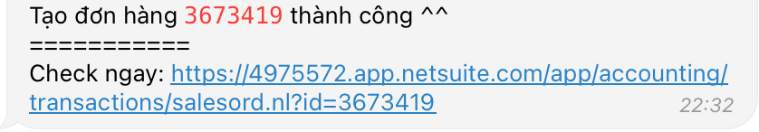
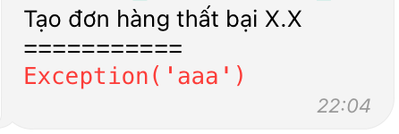

# Vuanem Ecommerce Service

  

- [Vuanem Ecommerce Service](#vuanem-ecommerce-service)
  - [Logic](#logic)
    - [Khách hàng](#khách-hàng)
    - [Sản phẩm](#sản-phẩm)
  - [Telegram](#telegram)
    - [Đơn mới](#đơn-mới)
    - [Tạo đơn thành công](#tạo-đơn-thành-công)
    - [Tạo đơn thất bại](#tạo-đơn-thất-bại)
  - [Sàn](#sàn)
    - [Tiki](#tiki)

---

## Logic

### Khách hàng

Việc mapping với KH trên NetSuite **chỉ dựa trên SĐT làm định danh của 1 KH**. Vì vậy sẽ có các case sau:

- Ko tìm thấy KH nào ứng với SĐT lên đơn ở sàn trên NetSuite: Tạo 1 KH mới với Tên + SĐT dựa trên thông tin từ trên sàn
- Tìm thấy ít nhất 1 KH ứng với SĐT lên đơn ở sàn trên NetSuite: Sử dụng KH **đầu tiên** tìm được ở trên NetSuite, sắp xếp theo thứ tự cũ trước - mới sau.
  - Ví dụ: 1 SĐT P có 2 KH A và B, KH A tồn tại từ 2020, KH B tồn tại từ 2021, sẽ chọn KH A.

### Sản phẩm

Việc mapping với item trên NetSuite **chỉ dựa vào SKU**. Vì vậy sẽ có các case sau:

- Ko tìm thấy item nào ứng với SKU từ sàn ở trên NetSuite: Ko tính item đó vào đơn
- Tìm thấy ít nhất 1 SKU ứng với SKU sàn ở trên NetSuite: Sử dụng Item **đầu tiên** tìm đc ở trên NetSuite, sắp xếp theo thứ tự cũ trước - mới sau.

---

## Telegram

Telegram đc vận hành bằng Bot để gửi tin nhắn và nhận yêu cầu từ ng dùng. Có 2 loại tin nhắn:

- **Thông tin**: Chỉ cung cấp thông tin, ko yêu cầu ng dùng input.
- **Yêu cầu**: Cung cấp các lựa chọn sẵn cho chính đối tượng tin nhắn đang nói đến, gắn vào với **chính tin nhắn đó** sẽ ko tạo ra thay đổi gì nếu ko có input của ng dùng.

### Đơn mới

Bot sẽ hiển thị thêm 1 nút **Tạo đơn**.

Nút **Tạo đơn** chỉ hoạt động 1 lần duy nhất, hãy chờ để bot trả lời bằng 1 trong 2 loại tin nhắn dưới. Nếu bấm ko ra cái gì thì khả năng cao là bot đã tự lọc trùng lượt bấm.

### Tạo đơn thành công

Bot sẽ hiển thị thông tin đơn hàng đã tạo & **đường link đến SO**.

### Tạo đơn thất bại

Bot sẽ hiển thị thông tin thất bại để ng làm bot ngồi khóc.

---

## Sàn

### Tiki

App sẽ check đơn hàng của Tiki **15p/lần**.

Tính năng hiện tại:

- Tạo đơn trên Tiki
  1. Thông báo đơn hàng mới:
     - Mã đơn
     - Thông tin khách hàng
       - SĐT
       - Địa chỉ
       - Phường
       - Quận
       - Thành phố
     - Sản phẩm
       - Tên
       - SKU
       - Số lượng
       - Giá
  2. Thông báo tạo đơn trên NetSuite: Thông tin về đơn hàng đã tạo:
     - **Cần thêm thông tin về Giao hàng**
     - Đường link mở đơn hàng để check
