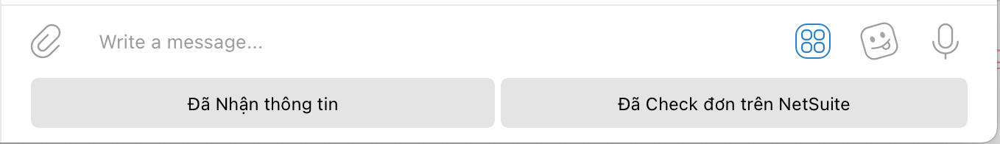

# Vuanem Ecommerce Service

- [Vuanem Ecommerce Service](#vuanem-ecommerce-service)
  - [Architect](#architect)
    - [SuiteScript](#suitescript)
    - [Event Handler App](#event-handler-app)
    - [Firestore](#firestore)
    - [Tiki](#tiki)
  - [Sử dụng](#sử-dụng)
    - [Telegram](#telegram)
    - [Tiki](#tiki-1)

---

## Architect

### SuiteScript

NetSuite Records are integrated using REST API specs. Details can be found on **Postman**.

- Methods:
  - `GET`: Get a Record
  - `POST`: Create a Record
  - `DELETE`: Soft delete a Record
- Response Statuses:
  - `200`: **Success**
  - `400`: **Not Found**
  - `>400`: **Failure**

### Event Handler App

NetSuite Event Handler App is built upon MVC architecture, using **Cloud Function/Functions Framework** as runtime.

The app follows semi-Functional Programming Paradigm.

### Firestore

Stateful data (Tiki ack_ids, etc) are stored in **Firestore** NoSQL.

### Tiki

Tiki utilises `Event Queue API`, polling data at a specified frequency. Upon receving events, the App will call `Resources API` to get details.

---

## Sử dụng

### Telegram

Với mỗi đơn hàng đc tạo trên các sàn, Telegram sẽ gửi 2 tin nhắn:

- Đã có đơn hàng đc tạo trên sàn
- Đơn hàng trên đã đc tạo thành công trên NetSuite

Với mỗi tin nhắn, App Telegram sẽ hiển thị thêm 2 nút quick reply:

Ng dùng có thể sử dụng để trả lời nhanh + reply vào tin nhắn vừa, đánh dấu tình trạng.

### Tiki

App sẽ check đơn hàng của Tiki **15p/lần**.

Tính năng hiện tại:

- Tạo đơn trên Tiki
  1. Thông báo tạo đơn: Thông tin về đơn hàng:
     - Mã đơn
     - SĐT
     - Địa chỉ
       - Địa chỉ
       - Phường
       - Quận
       - Thành phố
     - Sản phẩm
       - Tên
       - SKU
  2. Thông báo tạo đơn trên NetSuite: Thông tin về đơn hàng đã tạo:
     - **Cần thêm thông tin về Giao hàng**
     - Đường link mở đơn hàng để check
