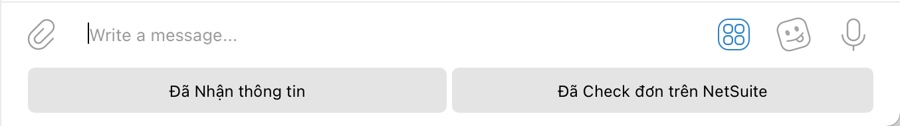
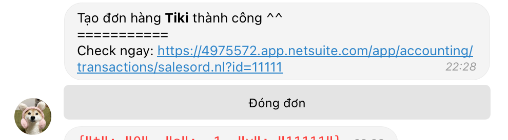

# Vuanem Ecommerce Service

  

- [Vuanem Ecommerce Service](#vuanem-ecommerce-service)
  - [Architect](#architect)
    - [SuiteScript](#suitescript)
    - [Event Handler App](#event-handler-app)
    - [Firestore](#firestore)
    - [Tiki](#tiki)
  - [Logic - Sử dụng](#logic---sử-dụng)
    - [Khách hàng](#khách-hàng)
    - [Sản phẩm](#sản-phẩm)
    - [Telegram](#telegram)
    - [Tiki](#tiki-1)

---

## Architect

### SuiteScript

NetSuite Records are integrated using REST API specs. Details can be found on **Postman**.

- Methods:
  - `GET`: Get a Record
  - `POST`: Create a Record
  - `DELETE`: Soft delete a Record (Close)
- Response Statuses:
  - `200`: Success
  - `400`: Not Found
  - `>400`: Failure

### Event Handler App

NetSuite Event Handler App is built upon MVC architecture, using **Cloud Function/Functions Framework** as runtime.

The app follows semi-Functional Programming Paradigm.

### Firestore

Stateful data (Tiki ack_ids, etc) are stored in **Firestore** NoSQL.

### Tiki

Tiki utilises `Event Queue API`, polling data at a specified frequency. Upon receving events, the App will call `Resources API` to get details.

---

## Logic - Sử dụng

### Khách hàng

Việc mapping với KH trên NetSuite **chỉ dựa trên SĐT làm định danh của 1 KH**. Vì vậy sẽ có các case sau:

- Ko tìm thấy KH nào ứng với SĐT lên đơn ở sàn trên NetSuite: Tạo 1 KH mới với Tên + SĐT dựa trên thông tin từ trên sàn
- Tìm thấy ít nhất 1 KH ứng với SĐT lên đơn ở sàn trên NetSuite: Sử dụng KH **đầu tiên** tìm được ở trên NetSuite, sắp xếp theo thứ tự cũ trước - mới sau.
  - Ví dụ: 1 SĐT P có 2 KH A và B, KH A tồn tại từ 2020, KH B tồn tại từ 2021, sẽ chọn KH A

### Sản phẩm

Việc mapping với item trên NetSuite **chỉ dựa vào SKU**. Vì vậy sẽ có các case sau:

- Ko tìm thấy item nào ứng với SKU từ sàn ở trên NetSuite: Ko tính item đó vào đơn
- Tìm thấy ít nhất 1 SKU ứng với SKU sàn ở trên NetSuite: Sử dụng Item **đầu tiên** tìm đc ở trên NetSuite, sắp xếp theo thứ tự cũ trước - mới sau.

### Telegram

Telegram đc vận hành bằng Bot để gửi tin nhắn và nhận yêu cầu từ ng dùng. Có 2 loại tin nhắn

- **Thông tin**: Chỉ cung cấp thông tin, ko yêu cầu ng dùng input
- **Yêu cầu**: Cung cấp các lựa chọn sẵn cho chính đối tượng tin nhắn đang nói đến, gắn vào với **chính tin nhắn đó** sẽ ko tạo ra thay đổi gì nếu ko có input của ng dùng

Với mỗi tin nhắn **thông tin**, Telegram sẽ hiển thị thêm 2 nút quick reply:

Ng dùng có thể sử dụng để trả lời nhanh + reply vào tin nhắn vừa, đánh dấu tình trạng. Dựa trên các tình huống trên sàn, Telegram sẽ gửi tin nhắn:

- Đã có đơn hàng đc tạo trên sàn
  - Bot sẽ hiển thị thêm 1 nút **Tạo đơn** .
- Đơn hàng trên đã đc tạo thành công trên NetSuite
  - Bot sẽ hiển thị thêm nút **Đóng đơn** .

### Tiki

App sẽ check đơn hàng của Tiki **15p/lần**.

Tính năng hiện tại:

- Tạo đơn trên Tiki
  1. Thông báo tạo đơn: Thông tin về đơn hàng:
     - Mã đơn
     - SĐT
     - Địa chỉ
       - Địa chỉ
       - Phường
       - Quận
       - Thành phố
     - Sản phẩm
       - Tên
       - SKU
  2. Thông báo tạo đơn trên NetSuite: Thông tin về đơn hàng đã tạo:
     - **Cần thêm thông tin về Giao hàng**
     - Đường link mở đơn hàng để check
