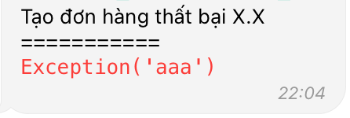

# Vuanem Ecommerce Service

- [Vuanem Ecommerce Service](#vuanem-ecommerce-service)
  - [Logic](#logic)
    - [Khách hàng](#khách-hàng)
    - [Sản phẩm](#sản-phẩm)
  - [Telegram](#telegram)
    - [Đơn mới](#đơn-mới)
    - [Tạo đơn thành công](#tạo-đơn-thành-công)
    - [Tạo đơn thất bại](#tạo-đơn-thất-bại)
  - [Tiki](#tiki)
    - [Tạo đơn](#tạo-đơn)
      - [Thông báo đơn hàng mới](#thông-báo-đơn-hàng-mới)
      - [Thông báo đơn hàng đã tạo trên NetSuite](#thông-báo-đơn-hàng-đã-tạo-trên-netsuite)
    - [KH mặc định](#kh-mặc-định)
  - [Lazada](#lazada)
    - [Tạo đơn](#tạo-đơn-1)
      - [Thông báo đơn hàng mới](#thông-báo-đơn-hàng-mới-1)
      - [Thông báo đơn hàng đã tạo trên NetSuite](#thông-báo-đơn-hàng-đã-tạo-trên-netsuite-1)
    - [KH mặc định](#kh-mặc-định-1)
  - [Shopee](#shopee)
    - [Tạo đơn](#tạo-đơn-2)
      - [Thông báo đơn hàng mới](#thông-báo-đơn-hàng-mới-2)
      - [Thông báo đơn hàng đã tạo trên NetSuite](#thông-báo-đơn-hàng-đã-tạo-trên-netsuite-2)
    - [KH mặc định](#kh-mặc-định-2)

## Logic

### Khách hàng

Việc mapping với KH trên NetSuite **chỉ dựa trên SĐT làm định danh của 1 KH**. Vì vậy sẽ có các case sau:

- Ko tìm thấy KH nào ứng với SĐT lên đơn ở sàn trên NetSuite: Tạo 1 KH mới với Tên + SĐT dựa trên thông tin từ trên sàn
- Tìm thấy ít nhất 1 KH ứng với SĐT lên đơn ở sàn trên NetSuite: Sử dụng KH **đầu tiên** tìm được ở trên NetSuite, sắp xếp theo thứ tự cũ trước - mới sau.
  - Ví dụ: 1 SĐT P có 2 KH A và B, KH A tồn tại từ 2020, KH B tồn tại từ 2021, sẽ chọn KH A.
- Đối với trường hợp chủ động sử dụng KH định sẵn, sẽ dựa theo KH mặc định của các sàn.

### Sản phẩm

Việc mapping với item trên NetSuite **chỉ dựa vào SKU**. Vì vậy sẽ có các case sau:

- Ko tìm thấy item nào ứng với SKU từ sàn ở trên NetSuite: Ko tính item đó vào đơn
- Toàn bộ các item trong đơn hàng trên sàn ko map dc với item nào trên NetSuite -> Đơn đó sẽ ko có item: Sẽ có lỗi, hiện đừng bấm tạo đơn khi đó
- Tìm thấy ít nhất 1 SKU ứng với SKU sàn ở trên NetSuite: Sử dụng Item **đầu tiên** tìm đc ở trên NetSuite, sắp xếp theo thứ tự cũ trước - mới sau

## Telegram

Bot Telgram sẽ gửi tin nhắn và nhận yêu cầu từ ng dùng. Có 2 loại tin nhắn:

- **Thông tin**: Chỉ cung cấp thông tin, ko yêu cầu ng dùng input
- **Yêu cầu**: Cung cấp các lựa chọn sẵn cho chính đối tượng tin nhắn đang nói đến, gắn vào với **chính tin nhắn đó** sẽ ko tạo ra thay đổi gì nếu ko có input của ng dùng. Khi bấm hành động/yêu cầu, bot sẽ hiển thị *Đợi xíu...* để xử lý, sau đó sẽ thực hiện logic & gửi các tin nhắn tiếp theo

### Đơn mới

Bot sẽ hiển thị thêm 1 nút **Tạo đơn**.


Nút **Tạo đơn** chỉ hoạt động **1 lần duy nhất**, hãy chờ để bot trả lời bằng 1 trong 2 loại tin nhắn dưới. Nếu bấm ko ra cái gì thì khả năng cao là bot đã tự lọc trùng lượt bấm.

### Tạo đơn thành công

Bot sẽ hiển thị thông tin đơn hàng đã tạo & **đường link đến SO**.


### Tạo đơn thất bại

Bot sẽ hiển thị thông tin thất bại để ng làm bot ngồi khóc.



## Tiki

App sẽ check đơn hàng của Tiki **15p/lần**.

### Tạo đơn

#### Thông báo đơn hàng mới

- Mã đơn
- Thông tin khách hàng
  - SĐT
  - Địa chỉ
  - Phường
  - Quận
  - Thành phố
- Sản phẩm
  - Tên
  - SKU
  - Số lượng
  - Giá
  
#### Thông báo đơn hàng đã tạo trên NetSuite

- Cần thêm thông tin về **Giao hàng**
- Đường link mở đơn hàng để check

### KH mặc định

```python
TIKI_CUSTOMER: Customer = {
    "entity": 979199,
    "custbody_customer_phone": "1998103102",
    "custbody_recipient_phone": "1998103102",
    "custbody_recipient": "TEMP Tiki",
    "shippingaddress": {
        "addressee": "TEMP Tiki",
    },
}
```

## Lazada

App sẽ check đơn hàng của Lazada **15p/lần**.

### Tạo đơn

#### Thông báo đơn hàng mới

Sản phẩm của Lazada tách rời - Tức là 1 đơn hàng có 1 SP số lượng 2, thì sẽ **tách thành 2 dòng chứ ko phải 1 dòng**

- Mã đơn
- Sản phẩm:
  - Tên
  - SKU
  - Giá

#### Thông báo đơn hàng đã tạo trên NetSuite

- Cần thêm thông tin về **Khách hàng**
- Cần thêm thông tin về **Giao hàng**
- Đường link mở đơn hàng để check

### KH mặc định

```python
LAZADA_CUSTOMER: Customer = {
    "entity": 987331,
    "custbody_customer_phone": "1998103103",
    "custbody_recipient_phone": "1998103103",
    "custbody_recipient": "TEMP Lazada",
    "shippingaddress": {
        "addressee": "TEMP Lazada",
    },
}
```

## Shopee

App sẽ check đơn hàng của Shopee **15p/lần**. Hệ thống của Shopee **ko trả đủ thông tin cụ thể** cho từng đơn hàng [Thiếu thông tin giá của từng sản phẩm]. Khuyến cáo **ko tạo đơn** từ Shopee.

### Tạo đơn

#### Thông báo đơn hàng mới

- Mã đơn
- Sản phẩm:
  - Tên
  - Số lượng
  - SKU
  - Giá

#### Thông báo đơn hàng đã tạo trên NetSuite

- Cần thêm thông tin về **Sản phẩm**
- Cần thêm thông tin về **Khách hàng**
- Cần thêm thông tin về **Giao hàng**
- Đường link mở đơn hàng để check

### KH mặc định

```python
SHOPEE_CUSTOMER: Customer = {
    "entity": 966287,
    "custbody_customer_phone": "1998103101",
    "custbody_recipient_phone": "1998103101",
    "custbody_recipient": "TEMP Shopee",
    "shippingaddress": {
        "addressee": "TEMP Shopee",
    },
}
```
